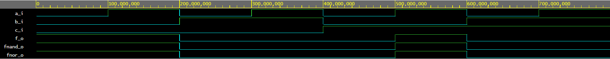
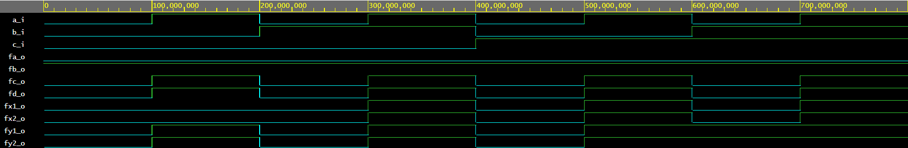

#DE1_cv1

##task1

[Link to GitHub repository] (https://github.com/PedroM42/Digital-electronics-1)

##task2

| **c** | **b** |**a** | **f(c,b,a)** |
| :-: | :-: | :-: | :-: |
| 0 | 0 | 0 | 1 |
| 0 | 0 | 1 | 1 |
| 0 | 1 | 0 | 0 |
| 0 | 1 | 1 | 0 |
| 1 | 0 | 0 | 0 |
| 1 | 0 | 1 | 1 |
| 1 | 1 | 0 | 0 |
| 1 | 1 | 1 | 0 |



```VHDL
architecture dataflow of gates is
begin
    
    f_o  <= ((not b_i) and a_i) or ((not c_i) and (not b_i));
    fnand_o <= (a_i nand (not b_i)) nand ((not b_i) nand (not c_i));  
    fnor_o <= (a_i nor (not c_i)) nor b_i;

end architecture dataflow;
```

[Code](https://www.edaplayground.com/x/JUC_)

##task3



```VHDL
architecture dataflow of gates is
begin
      fa_o  <= a_i and (not a_i);
      fb_o  <= a_i or (not a_i);
      fc_o  <= a_i or  a_i  or  a_i  or  a_i;
      fd_o  <= a_i and  a_i  and  a_i  and a_i;
      fx1_o <= (a_i and  b_i) or (a_i and  c_i);
      fx2_o <= a_i and (b_i or c_i);
      fy1_o <= ((a_i or b_i) and (a_i or c_i));
      fy2_o <= a_i or (b_i and c_i);

end architecture dataflow;
```