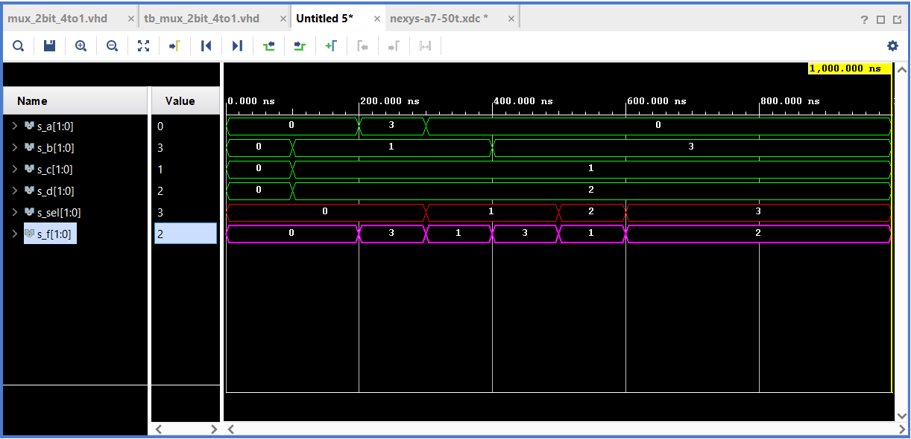

# DE1_cv_3

[Link to GitHub repository](https://github.com/PedroM42/Digital-electronics-1/tree/main/Labs/03_vivado)

## Task 1

| | **Name of pin for** | |
| :-: | :-: | :-: |
| **Number of** | **Switch** |  **LED**  |
| 0 | J15 | H17 |
| 1 | L16 | K15 |
| 2 | M13 | J13 |
| 3 | R15 | N14 |
| 4 | R17 | R18 |
| 5 | T18 | V17 |
| 6 | U18 | U17 |
| 7 | R13 | U16 |
| 8 | T8 | V16 |
| 9 | U8 | T15 |
| 10 | R16 | U14 |
| 11 | T13 | T16 |
| 12 | H6 | V15 |
| 13 | U12 | V14 |
| 14 | U11 | V12 |
| 15 | V10 | V11 |


## Task 2 

Listing of VHDL architecture from mux_2bit_4to1

```vhdl
architecture Behavioral of mux_2bit_4to1 is
begin
    
     f_o <= a_i when (sel_i = "00") else
            b_i when (sel_i = "01") else
            c_i when (sel_i = "10") else
            d_i;
            
            
end architecture Behavioral;
```

Listing of VHDL stimulus process from tb_mux_2bit_4to1

```vhdl
architecture testbench of tb_mux_2bit_4to1 is

    -- Local signals
    signal s_a       : std_logic_vector(2 - 1 downto 0);
    signal s_b       : std_logic_vector(2 - 1 downto 0);
    signal s_c       : std_logic_vector(2 - 1 downto 0);
    signal s_d       : std_logic_vector(2 - 1 downto 0);
    signal s_sel     : std_logic_vector(2 - 1 downto 0);
    
    signal s_f       : std_logic_vector(2 - 1 downto 0);

begin
    
    uut_mux_2bit_4to1 : entity work.mux_2bit_4to1
        port map(
            a_i           => s_a,
            b_i           => s_b,
            c_i           => s_c,
            d_i           => s_d,
            sel_i         => s_sel,
            
            f_o           => s_f
        );

    
    p_stimulus : process
    begin
        
        report "Stimulus process started" severity note;


        
        s_d <= "00"; s_c <= "00"; s_b <= "00"; s_a <= "00"; 
        s_sel <= "00"; wait for 100 ns;
        
        s_d <= "10"; s_c <= "01"; s_b <= "01"; s_a <= "00";  
        s_sel <= "00"; wait for 100 ns;
        
        s_d <= "10"; s_c <= "01"; s_b <= "01"; s_a <= "11";  
        s_sel <= "00"; wait for 100 ns;
        
        s_d <= "10"; s_c <= "01"; s_b <= "01"; s_a <= "00";  
        s_sel <= "01"; wait for 100 ns;
        
        s_d <= "10"; s_c <= "01"; s_b <= "11"; s_a <= "00";  
        s_sel <= "01"; wait for 100 ns;
        
        --s_d <= "10"; s_c <= "01"; s_b <= "11"; s_a <= "00";  
        s_sel <= "10"; wait for 100 ns;
        
        --s_d <= "10"; s_c <= "01"; s_b <= "11"; s_a <= "00";  
        s_sel <= "11"; wait for 100 ns;
        
        
        
        
        report "Stimulus process finished" severity note;
        wait;
    end process p_stimulus;

end architecture testbench;
```


## Task 3 

[Tutorial](Tutorial/vivado_tutorial.pdf)

