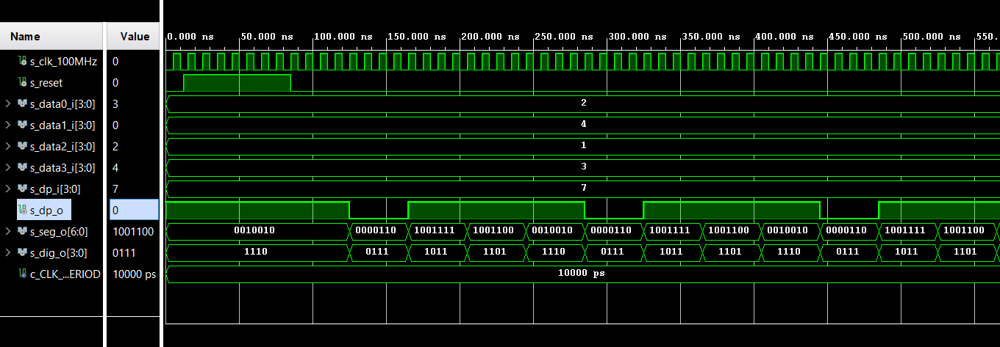
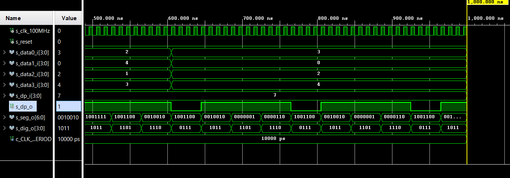
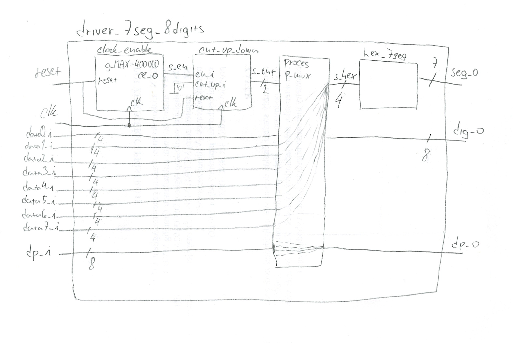

# DE1_cv6

[Link to GitHub repository](https://github.com/PedroM42/Digital-electronics-1)

## Task1


```vhdl
{
  signal:
  [
    ['Digit position',
      {name: 'Common anode: AN(3)', wave: 'xx01..01..01'},
      {name: 'AN(2)', wave: 'xx101..01..0'},
      {name: 'AN(1)', wave: 'xx1.01..01..'},
      {name: 'AN(0)', wave: 'xx1..01..01.'},
    ],
    ['Seven-segment data',
      {name: '4-digit value to display', wave: 'xx3333555599', data: ['3','1','4','2','3','1','4','2','3','1']},
      {name: 'Cathod A: CA', wave: 'xx01.0.1.0.1'},
      {name: 'CB', wave: 'xx0.........'},
      {name: 'CC', wave: 'xx0..10..10.'},
      {name: 'CD', wave: 'xx01.0.1.0.1'},
      {name: 'CE', wave: 'xx1..01..01.'},
      {name: 'CF', wave: 'xx1.01..01..'},
      {name: 'CG', wave: 'xx010..10..1'},
    ],
    {name: 'Decimal point: DP', wave: 'xx01..01..01'},
  ],
  head:
  {
    text: '                    4ms   4ms   4ms   4ms   4ms   4ms   4ms   4ms   4ms   4ms',
  },
}
```


## Task2 

### Listing of VHDL code of the process p_mux with syntax highlighting.

```vhdl
p_mux : process(s_cnt, data0_i, data1_i, data2_i, data3_i, dp_i)
    begin
        case s_cnt is
            when "11" =>
                s_hex <= data3_i;
                dp_o  <= dp_i(3);
                dig_o <= "0111";

            when "10" =>
                -- WRITE YOUR CODE HERE
                s_hex <= data2_i;
                dp_o  <= dp_i(2);
                dig_o <= "1011";

            when "01" =>
                -- WRITE YOUR CODE HERE
                s_hex <= data1_i;
                dp_o  <= dp_i(1);
                dig_o <= "1101";

            when others =>
                -- WRITE YOUR CODE HERE
                s_hex <= data0_i;
                dp_o  <= dp_i(0);
                dig_o <= "1110";
        end case;
    end process p_mux;

end architecture Behavioral;

```

### Listing of VHDL testbench file tb_driver_7seg_4digits with syntax highlighting and asserts
```vhdl
------------------------------------------------------------------------
--
-- Template for 4-digit 7-segment display driver testbench.
-- Nexys A7-50T, Vivado v2020.1.1, EDA Playground
--
-- Copyright (c) 2020-Present Tomas Fryza
-- Dept. of Radio Electronics, Brno University of Technology, Czechia
-- This work is licensed under the terms of the MIT license.
--
------------------------------------------------------------------------

library ieee;
use ieee.std_logic_1164.all;

------------------------------------------------------------------------
-- Entity declaration for testbench
------------------------------------------------------------------------
entity tb_driver_7seg_4digits is
    -- Entity of testbench is always empty
end entity tb_driver_7seg_4digits;

------------------------------------------------------------------------
-- Architecture body for testbench
------------------------------------------------------------------------
architecture testbench of tb_driver_7seg_4digits is

    -- Local constants
    constant c_CLK_100MHZ_PERIOD : time    := 10 ns;

    --Local signals
    signal s_clk_100MHz : std_logic;
    --- WRITE YOUR CODE HERE
    
    signal s_reset   : std_logic;

    signal s_data0_i : std_logic_vector(4 - 1 downto 0);
    signal s_data1_i : std_logic_vector(4 - 1 downto 0);
    signal s_data2_i : std_logic_vector(4 - 1 downto 0);
    signal s_data3_i : std_logic_vector(4 - 1 downto 0);
    signal s_dp_i    : std_logic_vector(4 - 1 downto 0);

    signal s_dp_o    : std_logic;

    signal s_seg_o   : std_logic_vector(7 - 1 downto 0);
    signal s_dig_o   : std_logic_vector(4 - 1 downto 0);
    
begin
    -- Connecting testbench signals with driver_7seg_4digits entity
    -- (Unit Under Test)
    --- WRITE YOUR CODE HERE
    uut_driver_7seg : entity work.driver_7seg_4digits
        port map(                     
            clk          => s_clk_100MHz,
            reset        => s_reset,
       
            data0_i      => s_data0_i,  
            data1_i      => s_data1_i,
            data2_i      => s_data2_i,
            data3_i      => s_data3_i,
            
            dp_i         => s_dp_i, 
            dp_o         => s_dp_o,
       
            seg_o        => s_seg_o,
            dig_o        => s_dig_o
                   
                
                   
        );                            

    --------------------------------------------------------------------
    -- Clock generation process
    --------------------------------------------------------------------
    p_clk_gen : process
    begin
        while now < 16ms loop         -- 75 periods of 100MHz clock
            s_clk_100MHz <= '0';
            wait for c_CLK_100MHZ_PERIOD / 2;
            s_clk_100MHz <= '1';
            wait for c_CLK_100MHZ_PERIOD / 2;
        end loop;
        wait;
    end process p_clk_gen;

    --------------------------------------------------------------------
    -- Reset generation process
    --------------------------------------------------------------------
    --- WRITE YOUR CODE HERE
    p_reset_gen : process
    begin
        s_reset <= '0';
        wait for 12 ns;
        
        -- Reset activated
        s_reset <= '1';
        wait for 73 ns;

        -- Reset deactivated
        s_reset <= '0';

        wait;
    end process p_reset_gen;

    --------------------------------------------------------------------
    -- Data generation process
    --------------------------------------------------------------------
    p_stimulus : process
    begin
        report "Stimulus process started" severity note;
        
        s_data3_i      <= "0011"; 
        s_data2_i      <= "0001";
        s_data1_i      <= "0100";
        s_data0_i      <= "0010";  
        s_dp_i         <= "0111";
        report "Stimulus process finished" severity note;
        wait;
    end process p_stimulus;
  

end architecture testbench;

```



## Task3


