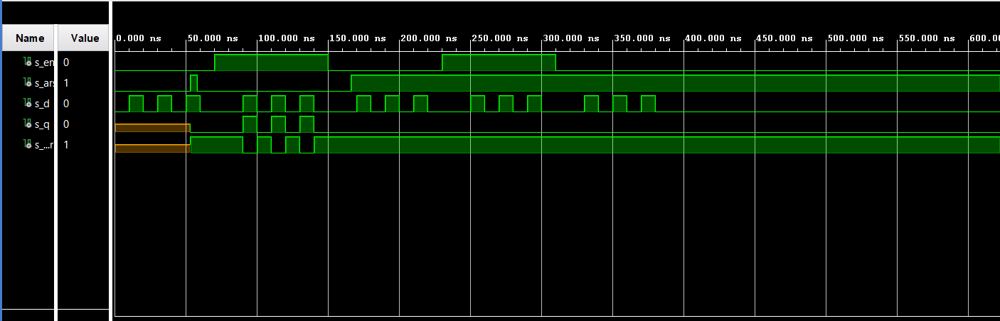
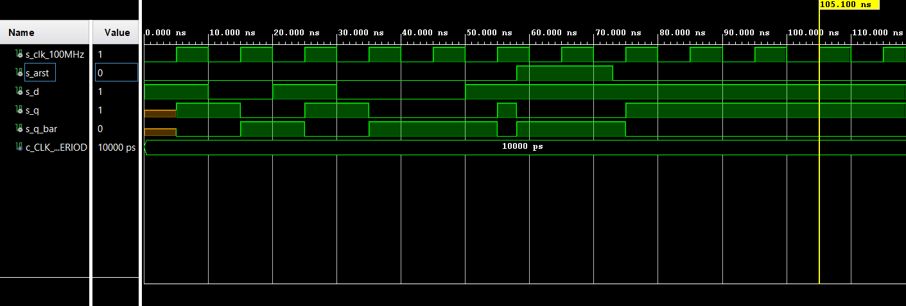
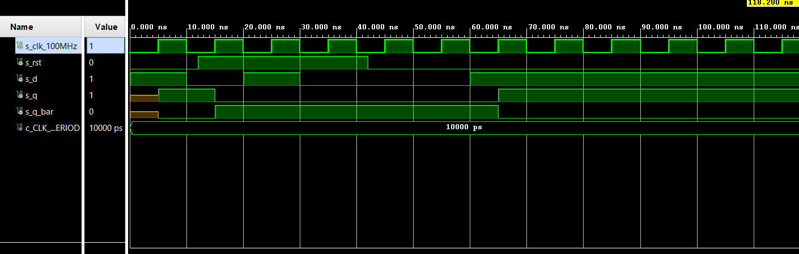
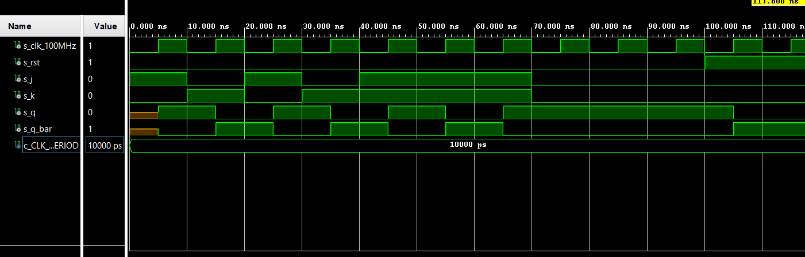
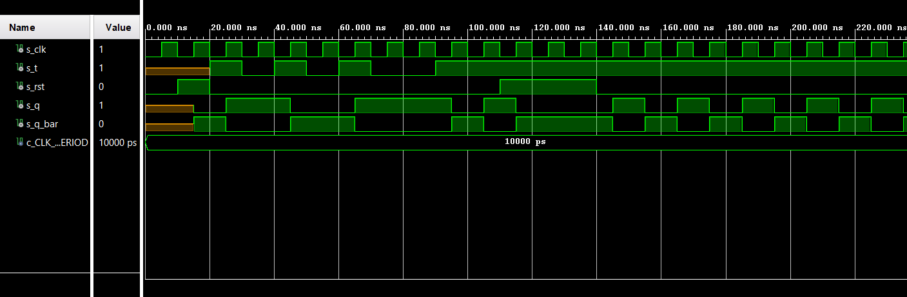

# DE1_cv7

[Link to GitHub repository](https://github.com/PedroM42/Digital-electronics-1)

## Task 1

### Characteristic equations for D, JK, T flip-flops
```vhdl
flip flops:
D: q_(n+1) = d
JK: q_(n+1) = j * (not q_n) + (not k) * q_n
T: q_(n+1) = t * (not q_n) + (not t) * q_n
```

### Characteristic table for D flip-flops
| **D** | **Qn** | **Q(n+1)** | **Comments** |
| :-: | :-: | :-: | :-- |
| 0 | 0 | 0 | No change |
| 0 | 1 | 0 | Change |
| 1 | 1 | 1 | No change |
| 1 | 0 | 1 | Change |

### Characteristic table for JK flip-flops
| **J** | **K** | **Qn** | **Q(n+1)** | **Comments** |
| :-: | :-: | :-: | :-: | :-- |
| 0 | 0 | 0 | 0 | No change |
| 0 | 0 | 1 | 1 | No change |
| 0 | 1 | 0 | 0 | Reset |
| 0 | 1 | 1 | 0 | Reset |
| 1 | 0 | 0 | 1 | Set |
| 1 | 0 | 1 | 1 | Set |
| 1 | 1 | 0 | 1 | Toggle |
| 1 | 1 | 1 | 0 | Toggle |

### Characteristic table for T flip-flops
| **T** | **Qn** | **Q(n+1)** | **Comments** |
| :-: | :-: | :-: | :-- |
| 0 | 0 | 0 | No change |
| 0 | 1 | 1 | No change |
| 1 | 0 | 1 | Toggle |
| 1 | 1 | 0 | Toggle |


## Task 2 

### VHDL code listing of the process p_d_latch with syntax highlighting
```vhdl
p_d_latch : process (d, arst, en)
    begin
       if (arst = '1') then
           q <= '0';
           q_bar <= '1';
           
       elsif (en = '1') then
           q <=d;
           q_bar <= not d;
           
       end if;
    end process p_d_latch;
```

### Listing of VHDL reset and stimulus processes from the testbench tb_d_latch.vhd file with syntax highlighting and asserts
```vhdl
p_reset_gen : process
    begin
        s_arst <= '0';
        wait for 53 ns;
        
        -- Reset activated
        s_arst <= '1';
        wait for 5 ns;

        -- Reset deactivated
        s_arst <= '0';
        
        
        wait for 108 ns;
        s_arst <= '1';
        
        wait;
    end process p_reset_gen;


 p_stimulus : process
    begin
        report "Stimulus process started" severity note;
        s_en    <=  '0';
        s_d     <=  '0'; 
        
        wait for 10 ns;
        s_d <= '1';
        wait for 10 ns;
        s_d <= '0';
        wait for 10 ns;
        s_d <= '1';
        wait for 10 ns;
        s_d <= '0';
        wait for 10 ns;
        s_d <= '1';
        wait for 10 ns;
        s_d <= '0';
        wait for 10 ns;
        
        s_en <= '1';
        wait for 10 ns;
        assert (s_q = '0' and s_q_bar = '1') 
        report "Tienes un problema(1)" severity error;
        
        wait for 10 ns;
        s_d <= '1';
        wait for 10 ns;
        s_d <= '0';
        wait for 10 ns;
        s_d <= '1';
        wait for 10 ns;
        s_d <= '0';
        wait for 10 ns;
        s_d <= '1';
        wait for 10 ns;
        s_d <= '0';
        wait for 10 ns;
        
        s_en <= '0';
        wait for 10 ns;
        assert (s_q = '0' and s_q_bar = '1') 
        report "Tienes un problema(2)" severity error;
        
        wait for 10 ns;
        s_d <= '1';
        wait for 10 ns;
        s_d <= '0';
        wait for 10 ns;
        s_d <= '1';
        wait for 10 ns;
        s_d <= '0';
        wait for 10 ns;
        s_d <= '1';
        wait for 10 ns;
        s_d <= '0';
        wait for 10 ns;
        
        s_en <= '1';
        wait for 10 ns;
        assert (s_q = '1' and s_q_bar = '0') 
        report "Tienes un problema(3)" severity error;
        
        wait for 10 ns;
        s_d <= '1';
        wait for 10 ns;
        s_d <= '0';
        wait for 10 ns;
        s_d <= '1';
        wait for 10 ns;
        s_d <= '0';
        wait for 10 ns;
        s_d <= '1';
        wait for 10 ns;
        s_d <= '0';
        wait for 10 ns;
        
        s_en <= '0';
        wait for 10 ns;
        assert (s_q = '1' and s_q_bar = '0') 
        report "Tienes un problema(4)" severity error;
        
        wait for 10 ns;
        s_d <= '1';
        wait for 10 ns;
        s_d <= '0';
        wait for 10 ns;
        s_d <= '1';
        wait for 10 ns;
        s_d <= '0';
        wait for 10 ns;
        s_d <= '1';
        wait for 10 ns;
        s_d <= '0';
        wait for 10 ns;
        
        
        
       
       
        wait;
    end process p_stimulus;
end Behavioral;
```


## Task 3

### VHDL code listing of the processes p_d_ff_arst with syntax highlighting
```vhdl
 p_d_ff_arst : process (clk, arst)
        begin
           if (arst = '1') then
               q <= '0';
               q_bar <= '1';
               
           elsif rising_edge(clk) then
               q <=d;
               q_bar <= not d;
               
           end if;
        end process p_d_ff_arst;
```
### Reset and Stimulus
```vhdl
 p_clk_gen : process
    begin
        while now < 16ms loop         
            s_clk_100MHz <= '0';
            wait for c_CLK_100MHZ_PERIOD / 2;
            s_clk_100MHz <= '1';
            wait for c_CLK_100MHZ_PERIOD / 2;
        end loop;
        wait;
    end process p_clk_gen;
    
    p_reset_gen : process
    begin
        s_arst <= '0';
        wait for 58 ns;
        
        s_arst <= '1';
        wait for 15 ns;
        
        s_arst <= '0';

        wait;
    end process p_reset_gen;
    
    p_stimulus : process
    begin
        report "Stimulus process started" severity note;
        s_d     <=  '1';
        wait for 10ns;
        
        assert (s_q = '0' and s_q_bar = '1') 
        report "Tienes un problema(1)" severity error;
        
        s_d     <=  '0';
        wait for 10ns;
        
        assert (s_q = '1' and s_q_bar = '0') 
        report "Tienes un problema(2)" severity error;
        
        s_d     <=  '1';
        wait for 10ns;
        
        assert (s_q = '1' and s_q_bar = '0') 
        report "Tienes un problema(3)" severity error;
       
        s_d     <=  '0';
        wait for 10ns;
        
        assert (s_q = '0' and s_q_bar = '1') 
        report "Tienes un problema(4)" severity error;
        
        wait for 10ns;
        s_d     <=  '1';
        wait for 10ns;
        
        assert (s_q = '1' and s_q_bar = '0') report 
        "Failed no. 5" severity note;
        report "Tienes un problema(5)" severity error;
        wait;
    end process p_stimulus;
end Behavioral;
```

### VHDL code listing of the processes p_d_ff_rst with syntax highlighting
```vhdl
p_d_ff_arst : process(clk)
    begin        
        if rising_edge(clk) then
            if (rst = '1') then
                q       <= '0';
                q_bar   <= '1';
            else
                q       <= d;
                q_bar   <= not d;
            end if;
        end if;
    end process p_d_ff_arst;
```
### Reset and Stimulus
```vhdl
 p_clk_gen : process
    begin
        while now < 750 ns loop
            s_clk_100MHz <= '0';
            wait for c_CLK_100MHZ_PERIOD / 2;
            s_clk_100MHz <= '1';
            wait for c_CLK_100MHZ_PERIOD / 2;
        end loop;
        wait;
    end process p_clk_gen;
    
    p_reset_gen : process
    begin
        s_rst <= '0';
        wait for 12 ns;
        
        s_rst <= '1';
        wait for 30 ns;
        
        s_rst <= '0';
        wait;
    end process p_reset_gen;

    p_stimulus : process
    begin
       
        report "Stimulus process started" severity note;
        s_d     <=  '1';
        wait for 10ns;
        
        assert (s_q = '1' and s_q_bar = '0') 
        report "Tienes un problema(1)" severity error;
        
        s_d     <=  '0';
        wait for 10ns;
        
        assert (s_q = '0' and s_q_bar = '1') 
        report "Tienes un problema(2)" severity error;
        
        s_d     <=  '1';
        wait for 10ns;
        
        assert (s_q = '0' and s_q_bar = '1') 
        report "Tienes un problema(3)" severity error;
       
        s_d     <=  '0';
        wait for 10ns;
        
        assert (s_q = '0' and s_q_bar = '1') 
        report "Tienes un problema(4)" severity error;
        
        wait for 20ns;
        s_d     <=  '1';
        wait for 25ns;
        
        assert (s_q = '1' and s_q_bar = '0') 
        report "Tienes un problema(5)" severity error;
        
        report "Stimulus process ended" severity note;
        wait;
    end process p_stimulus;
```

### VHDL code listing of the processes p_jk_ff_rst with syntax highlighting
```vhdl
 p_jk_ff_rst : process(clk)
    begin
        if rising_edge(clk) then
            if (rst = '1') then
                s_q         <=  '0';
                s_q_bar     <=  '1'; 
             else
                if (j = '0' and k = '0') then
                    s_q     <=  s_q;
                    s_q_bar <=  s_q_bar;
                    
                elsif (j = '0' and k = '1') then
                    s_q     <=  '0';
                    s_q_bar <=  '1';
                    
                elsif (j = '1' and k = '0') then
                    s_q     <=  '1';
                    s_q_bar <=  '0';
                    
                else 
                    s_q     <=  not s_q;
                    s_q_bar <=  not s_q_bar;
                    
                end if;
             end if;
        end if;
     end process p_jk_ff_rst;

     q       <=  s_q;
     q_bar   <=  s_q_bar;
```
### Reset and Stimulus
```vhdl
  p_clk_gen : process
    begin
        while now < 750 ns loop
            s_clk_100MHz <= '0';
            wait for c_CLK_100MHZ_PERIOD / 2;
            s_clk_100MHz <= '1';
            wait for c_CLK_100MHZ_PERIOD / 2;
        end loop;
        wait;
    end process p_clk_gen;
    
    p_reset_gen : process
    begin
        s_rst   <= '0';
        wait for 100 ns;
        
        s_rst   <= '1';
        wait for 80 ns;
        
        s_rst   <= '0';
        wait;
    end process p_reset_gen;

    p_stimulus : process
    begin
        report "Stimulus process started" severity note;
        
        s_j <=  '1';
        s_k <=  '0'; 
        wait for 10ns;
        
        assert (s_q = '1' and s_q_bar = '0') 
        report "Tienes un problema(1)" severity error;
        
        s_j <=  '0';
        s_k <=  '1';
        wait for 10ns;
        
        assert (s_q = '0' and s_q_bar = '1') 
        report "Tienes un problema(2)" severity error;
        
        s_j <=  '1';
        s_k <=  '0';
        wait for 10ns;
        
        assert (s_q = '1' and s_q_bar = '0') 
        report "Tienes un problema(3)" severity error;
        
        s_j <=  '0';
        s_k <=  '1';    
        wait for 10ns;
        
        assert (s_q = '0' and s_q_bar = '1') 
        report "Tienes un problema(4)" severity error;
        
        s_j <=  '1';
        s_k <=  '1';
        wait for 10ns;
        
        assert (s_q = '1' and s_q_bar = '0') 
        report "Tienes un problema(5)" severity error;
        
        s_j <=  '1';
        s_k <=  '1';
        wait for 10ns;
        
        assert (s_q = '0' and s_q_bar = '1') 
        report "Tienes un problema(6)" severity error;
        
        s_j <=  '1';
        s_k <=  '1';
        wait for 10ns;        
        
        assert (s_q = '1' and s_q_bar = '0') 
        report "Tienes un problema(7)" severity error;
        
        s_j <=  '0';
        s_k <=  '0';
        wait for 10ns;
        
        assert (s_q = '1' and s_q_bar = '0') 
        report "Tienes un problema(8)" severity error;
        
        report "Stimulus process ended" severity note;
        wait;
    end process p_stimulus;


```

### VHDL code listing of the processes p_t_ff_rst with syntax highlighting
```vhdl
t_ff_rst : process(clk)
    begin
        if rising_edge(clk) then
            if (rst = '1') then
                s_q         <=  '0';
                s_q_bar     <=  '1'; 
                
             else
                if (t = '0') then
                    s_q     <=  s_q;
                    s_q_bar <=  s_q_bar;
                    
                else 
                    s_q     <=  not s_q;
                    s_q_bar <=  not s_q_bar;
                    
                end if;
             end if;
        end if;
    end process t_ff_rst;

    q       <=  s_q;
    q_bar   <=  s_q_bar;
```
### Reset and Stimulus
```vhdl
 p_clk_gen : process
    begin
        while now < 750 ns loop         -- 75 periods of 100MHz clock
            s_clk   <= '0';
            wait for c_CLK_100MHZ_PERIOD / 2;
            s_clk   <= '1';
            wait for c_CLK_100MHZ_PERIOD / 2;
        end loop;
        wait;
    end process p_clk_gen;
    
    --------------------------------------------------------------------
    -- Reset generation process
    --------------------------------------------------------------------
    p_reset_gen : process
    begin
        s_rst   <= '0';
        wait for 10 ns;
        
        s_rst   <= '1';              
        wait for 10 ns;
        
        s_rst   <= '0';
        wait for 90 ns;
        
        s_rst   <= '1';
        wait for 30 ns;
        
        s_rst   <= '0';
        wait;
    end process p_reset_gen;

    
    p_stimulus : process
    begin

        report "Stimulus process started. " severity note;
        
        wait for 20 ns;
        s_t <=  '1';
        wait for 10ns;
        
        assert (s_q = '1' and s_q_bar = '0') 
        report "Tienes un problema(1)" severity error;
        s_t <=  '0';
        wait for 10ns;
        
        assert (s_q = '1' and s_q_bar = '0') 
        report "Tienes un problema(2)" severity error;
        
        s_t <=  '1';        
        wait for 10ns;
        
        assert (s_q = '0' and s_q_bar = '1') 
        report "Tienes un problema(3)" severity error; 
              
        s_t <=  '0';      
        wait for 10ns;     
        
        assert (s_q = '0' and s_q_bar = '1') 
        report "Tienes un problema(4)" severity error;
        
        s_t <=  '1';
        wait for 10ns;
        
        assert (s_q = '1' and s_q_bar = '0') 
        report "Tienes un problema(5)" severity error; 
        
        s_t <=  '0';
        wait for 10ns;
        
        assert (s_q = '1' and s_q_bar = '0') 
        report "Tienes un problema(6)" severity error;  
        
        s_t <=  '0';
        wait for 10ns;
        
        assert (s_q = '1' and s_q_bar = '0') 
        report "Tienes un problema(7)" severity error;
        
        s_t <=  '1';      
        wait for 10ns;       
        
        assert (s_q = '0' and s_q_bar = '1') 
        report "Tienes un problema(8)" severity error;  
                
        report "Stimulus process ended. " severity note;
        wait;
    end process p_stimulus;

```
